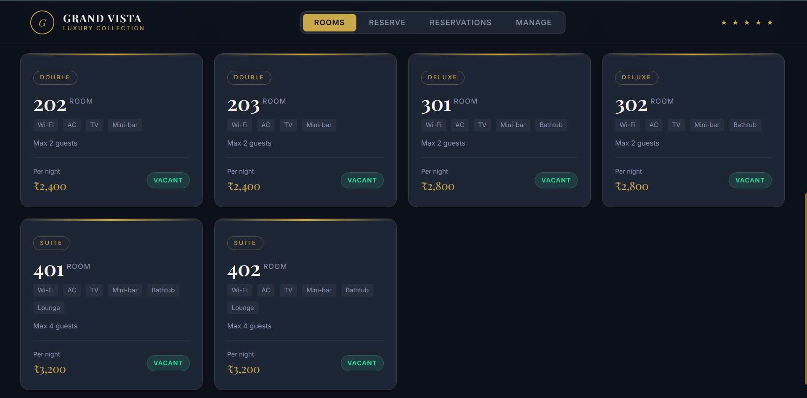
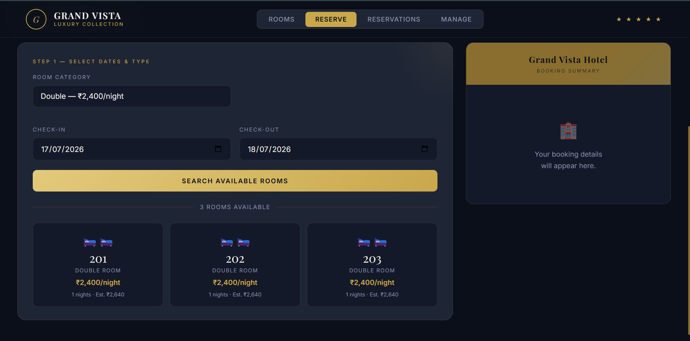
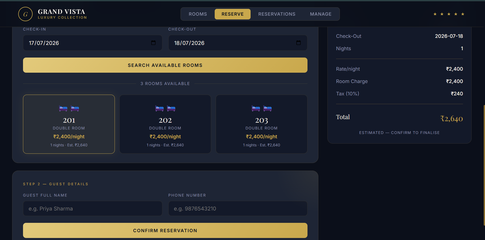
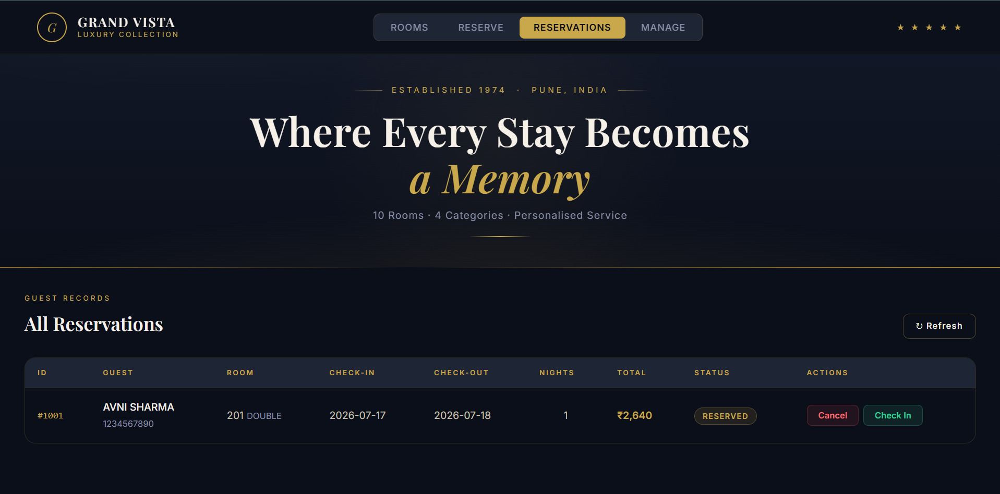
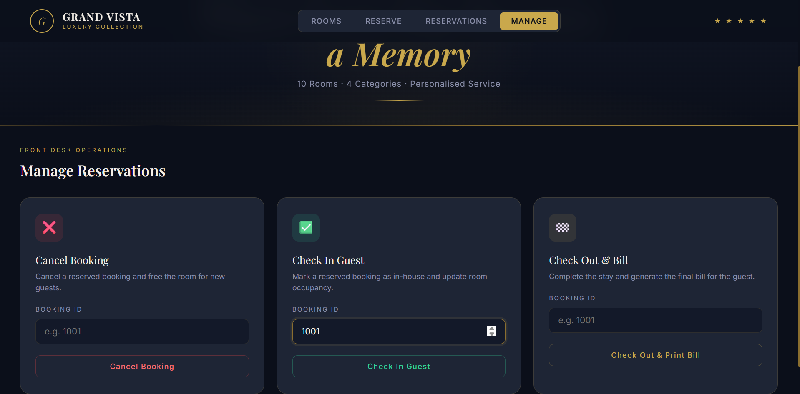
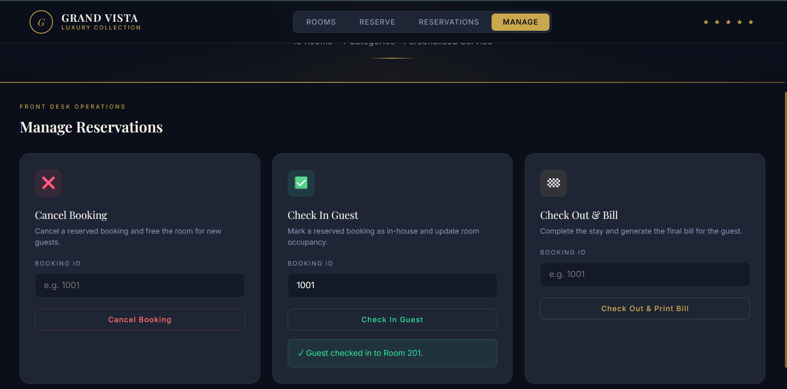
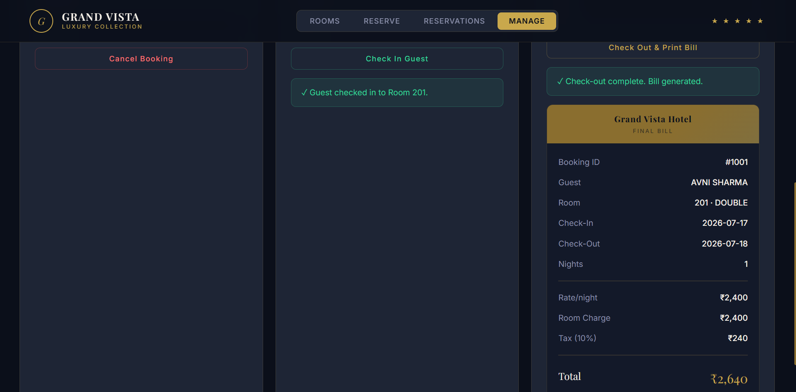

<div align="center">

# 🏨 Hotel Room Booking Console App

### *Java Console Application + Flask Web Dashboard*


<br/><br/>

**[🌐 Live Demo](https://hotel-room-booking-console-app.onrender.com)**
&nbsp;&nbsp;·&nbsp;&nbsp;
**[💻 Source Code](https://github.com/Neha-Joshi05/Hotel-Room-Booking-Console-App.git)**
&nbsp;&nbsp;·&nbsp;&nbsp;
**[📸 Screenshots](#screenshots)**

</div>

---

## 📸 Screenshots

<div align="center">

### Dashboard — Room Inventory


<br/>

### Make a Reservation


<br/>

### Search Available Rooms


<br/>

### Booking Confirmation & Bill


<br/>

### All Reservations Table


<br/>

### Front Desk — Manage Operations


<br/>

### Java Console App Output


<br/>

</div>

---

## 🎯 Objective

Build a complete hotel room booking system in Java that lets users
search rooms, create bookings, check in/out, and generate bills —
with full OOP design, business logic validation, and a live
deployed Flask web dashboard.

---

## 📖 What is This Project?

**Simple explanation:**
A digital front desk for a hotel. Instead of a receptionist using
a paper register, this system manages room availability, takes
bookings, tracks check-ins and check-outs, and prints bills —
all through code.

**Technical explanation:**
A Java-based application implementing the full hotel booking
lifecycle using OOP principles. `Room`, `Booking`, and `RoomType`
(enum) form the domain model. `HotelService` handles business logic
including date-range overlap detection to prevent double bookings.
`BigDecimal` ensures precise monetary calculations. A companion
Flask web dashboard mirrors the same logic for live deployment
on Render.

---

## 🔄 Booking Workflow

```
User Opens App
      ↓
View Available Rooms (by type + date)
      ↓
Select Room → Enter Guest Details
      ↓
System Validates (availability + dates)
      ↓
Booking Created → ID Generated
      ↓
Bill Calculated (nights × rate + 10% tax)
      ↓
Check In → Room Status: OCCUPIED
      ↓
Check Out → Bill Printed → Room: VACANT
```

---

## ✨ Features

| Feature | Status |
|---|---|
| View all rooms with live status | ✅ |
| Search rooms by type and date range | ✅ |
| Double-booking prevention (overlap check) | ✅ |
| Create booking with auto-generated ID | ✅ |
| Guest details (name, phone) | ✅ |
| Bill calculation (rate × nights + 10% tax) | ✅ |
| Check-in / Check-out workflow | ✅ |
| Cancel reservation | ✅ |
| View all bookings with status | ✅ |
| Live web dashboard (Flask) | ✅ |
| Deployed on Render (free tier) | ✅ |
| Java console app (standalone) | ✅ |

---

## 🏭 Industry Relevance

Similar booking systems power real businesses:

| Industry | Application |
|---|---|
| **Hotels & Resorts** | Room PMS (Property Management System) |
| **Hostels** | Bed-level booking and occupancy tracking |
| **Travel Platforms** | MakeMyTrip, Booking.com backend logic |
| **Corporate Housing** | Guest house and serviced apartment management |
| **Healthcare** | Hospital bed allocation systems |
| **Airlines** | Seat booking — same overlap logic applies |

---

## 🛠️ Tech Stack

| Layer | Technology |
|---|---|
| Console App | Java 17, Collections, BigDecimal, LocalDate |
| Web Backend | Python 3, Flask |
| Frontend | HTML, CSS (custom luxury theme), JavaScript |
| Fonts | Playfair Display + Inter (Google Fonts) |
| Deployment | Render (free tier) |
| Version Control | Git + GitHub |

---

## 🏗️ Architecture

```
┌─────────────────────────────────────────────────┐
│               USER INTERFACE                    │
│         Java Console  /  Flask Dashboard        │
└─────────────────────┬───────────────────────────┘
                      │
┌─────────────────────▼───────────────────────────┐
│               BUSINESS LOGIC                    │
│  HotelService / hotel_model.py                  │
│  • Room availability check                      │
│  • Date range overlap detection                 │
│  • Bill calculation (BigDecimal)                │
│  • Booking lifecycle management                 │
└──────────┬────────────────────┬─────────────────┘
           │                    │
┌──────────▼────────┐  ┌────────▼───────────────── ┐
│   DOMAIN MODEL    │  │      DATA STORE            │
│  Room.java        │  │  In-memory HashMap          │
│  Booking.java     │  │  (JDBC/MySQL in v2)         │
│  RoomType (enum)  │  │                             │
└───────────────────┘  └─────────────────────────── ┘
```

---

## 📁 Folder Structure

```
Hotel-Room-Booking-Console-App/
│
├── java_app/
│   └── HotelApp.java              ← Complete Java console app
│
├── dashboard/
│   ├── app.py                     ← Flask web server + REST API
│   ├── hotel_model.py             ← Python booking logic (mirrors Java)
│   └── templates/
│       └── index.html             ← Luxury hotel web dashboard
│
├── screenshots/                   ← All proof-of-work screenshots
│   ├── 01_rooms_tab.png
│   ├── 02_book_tab.png
│   ├── 03_available_rooms.png
│   ├── 04_bill_summary.png
│   ├── 05_bookings_table.png
│   ├── 06_manage_tab.png
│   ├── 07_java_console.png
│   └── 08_github_repo.png
│
├── data/                          ← Sample booking records
├── docs/                          ← Architecture diagrams
├── outputs/                       ← Sample console outputs
├── requirements.txt               ← Python dependencies
├── Procfile                       ← Render deployment config
├── .gitignore
└── README.md
```

---

## 🚀 How to Run

### Option A — Java Console App

```bash
# Navigate to java_app folder
cd java_app

# Compile
javac HotelApp.java

# Run
java HotelApp
```

### Option B — Flask Web Dashboard

```bash
# Install dependencies
pip install -r requirements.txt

# Run dashboard
python dashboard/app.py

# Open browser
http://localhost:5000
```

### Option C — IntelliJ IDEA

1. Open IntelliJ → **File → Open** → select `java_app` folder
2. Set Java SDK to **17 or higher**
3. Right-click `HotelApp.java` → **Run 'HotelApp.main()'**

---

## 🏨 Room Configuration

| Room | Type | Rate/Night | Capacity |
|---|---|---|---|
| 101, 102, 103 | Single | ₹2,000 | 1 guest |
| 201, 202, 203 | Double | ₹2,400 | 2 guests |
| 301, 302 | Deluxe | ₹2,800 | 2 guests |
| 401, 402 | Suite | ₹3,200 | 4 guests |

**Pricing formula:**
```
Room Charge = Nightly Rate × Number of Nights
Tax         = Room Charge × 10%
Total Bill  = Room Charge + Tax
```

---

## 📊 Sample Console Output

```
╔══════════════════════════════════════════╗
║     GRAND VISTA HOTEL — BOOKING SYSTEM   ║
║         Console App  |  Java 17+          ║
╚══════════════════════════════════════════╝

══════════════ MAIN MENU ══════════════
  1. View All Rooms
  2. Search Available Rooms
  3. Create Booking
  4. View Booking Details
  5. Cancel Booking
  6. Check In
  7. Check Out & Print Bill
  8. View All Bookings
  9. Exit
═══════════════════════════════════════

──────────── BOOKING DETAILS ────────────
  Booking ID   : #1001
  Guest Name   : Priya Sharma
  Phone        : 9876543210
  Room Number  : 201 (Double)
  Check-In     : 2025-12-20
  Check-Out    : 2025-12-23
  Nights       : 3
  Nightly Rate : Rs.2400.00
  Room Charge  : Rs.7200.00
  Tax (10%)    : Rs.720.00
  TOTAL        : Rs.7920.00
  Status       : RESERVED
──────────────────────────────────────────
```

---

## 🧪 Test Cases

| Test | Input | Expected Result |
|---|---|---|
| Valid booking | Room 101, 2 nights, valid name | Booking created ✅ |
| Double booking | Same room, overlapping dates | Blocked ❌ |
| Past check-in | Date before today | Validation error ❌ |
| Checkout before check-in | End < Start | Error shown ❌ |
| Cancel reserved | Booking ID 1001 | Cancelled ✅ |
| Cancel in-house | Booking already checked in | Error ❌ |
| Wrong booking ID | ID 9999 | Not found ❌ |
| Empty guest name | No name entered | Validation error ❌ |

---

## 🔑 Key Java Concepts Used

| Concept | Where Used |
|---|---|
| **Enum** | `RoomType` — type-safe room categories with rate multipliers |
| **BigDecimal** | All monetary calculations — avoids floating point errors |
| **LocalDate** | Check-in/out dates — modern Java date API |
| **HashMap** | O(1) room and booking lookup by ID |
| **Date Overlap Logic** | `aStart < bEnd && bStart < aEnd` prevents double bookings |
| **Encapsulation** | All fields in model classes with controlled access |
| **Switch Expression** | Java 17 arrow syntax for clean menu handling |
| **Input Validation** | `readInt`, `readDate`, `readNonEmpty` methods |

---


## 🔮 Future Improvements

- JDBC + MySQL database integration
- Spring Boot REST API backend
- Customer and admin login roles
- Razorpay / Stripe payment simulation
- Email booking confirmation
- Discount and coupon code system
- Room photos and virtual tour
- Multi-property support
- Mobile app (React Native)
- AI chatbot for room recommendations

---


## 🎓 Learning Outcomes

- Java OOP — classes, enums, encapsulation
- BigDecimal for precise financial calculations
- LocalDate and date range overlap algorithms
- HashMap for O(1) data lookup
- Input validation and exception handling
- Flask REST API design
- Full-stack web development
- Cloud deployment (Render)
- Git version control strategy

---


## 👤 Author

**Neha Joshi**
- GitHub: https://github.com/Neha-Joshi05/Hotel-Room-Booking-Console-App.git
- LinkdIn : https://www.linkedin.com/in/neha-joshi-0851a2322?utm_source=share_via&utm_content=profile&utm_medium=member_android

<div align="center">
<br/>

<br/><br/>

*Built with ☕ Java + 🐍 Python · Deployed on Render*

</div>